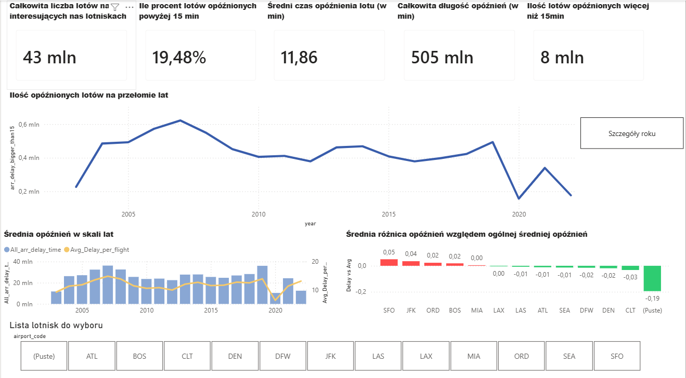
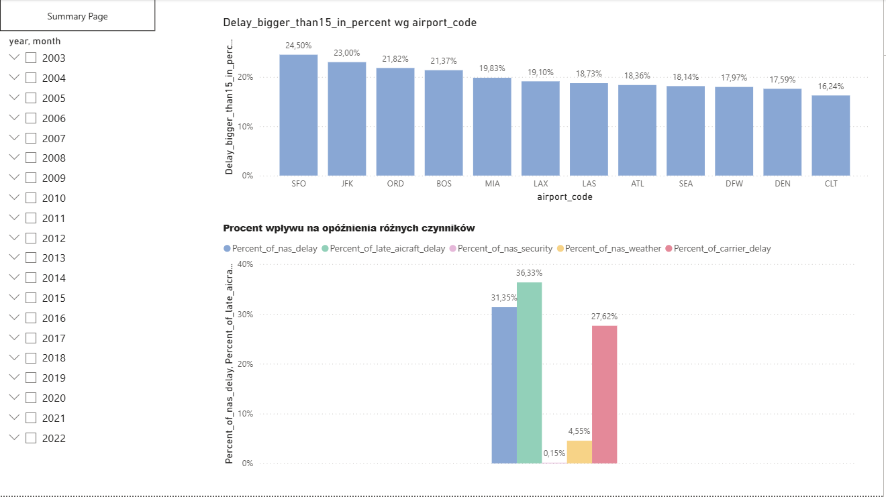

# Flight Delay Analysis Dashboard

## Overview

Interactive Power BI dashboard analyzing flight delays across multiple airports and years.

## Features

- KPI monitoring
- Delay trend analysis
- Airport comparison
- Delay cause analysis
- Interactive filters
- Multi-page report

## Tools Used

- Power BI
- DAX
- Power Query
- 
## Dashboard Preview

### Summary Page

### Year Details Page

